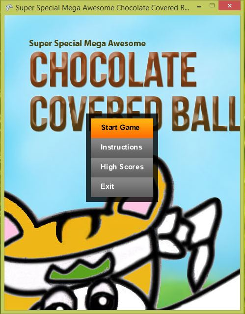
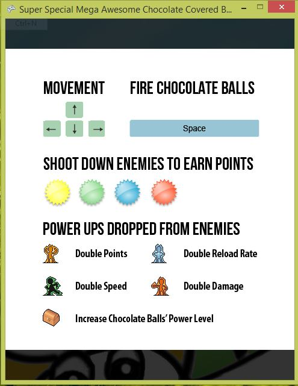
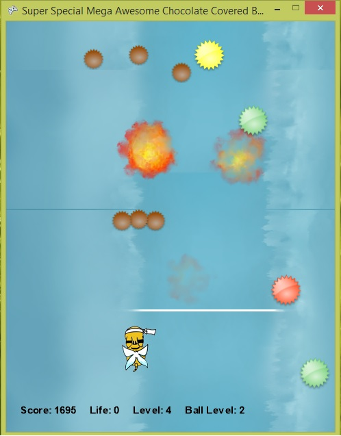

About
===

This is a simple 2D shooter game based on a game on Neopets called [Pterattack](http://www.neopets.com/games/game.phtml?game_id=587). This was developed by my partner (Melody W. Leung) and I (Stephen Li) for our Grade 12 Computer Science final project. I did most of the XNA-related work while my partner did most of the artwork and the high score system.

Screenshots
---

How to run
---

1. Download and extract `publish.zip`
2. Run `setup.exe`
